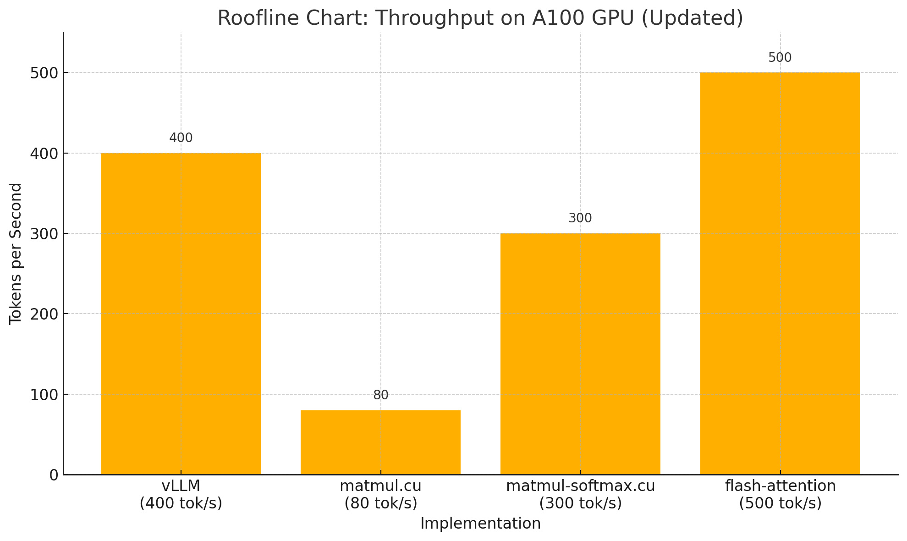

To run this model, login to modal first, then goes to my cu directory, for example:C:\Users\yourname\xxx\project5
Then, run "modal run cuda_run.py --code-path code/softmax.cu", it will run the code in "code" folder. change softmax.cu to flash.cu for flash attention version, and run.cu for matmul only version
Since the llama2 modal is way too big (25g), I can't upload it to github.
If you have the converted llama2 model, you can go to "cuda_run.py" and change command line accordingly.

vllm vs original llama2.c vs cuda: 
vllm 500 token/s running 7b chat model 
original llama2.c running small story model:40 token/s 
cuda version with matmul on gpu: 70token/s 
cuda version with matmul,softmax and silu,rope,multi_head attention on gpu: 300token/s 
cuda version with matmul,softmax and silu,rope,multi_head attention on gpu plus flash attention: 400token/s 

